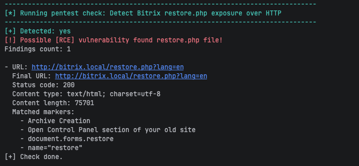
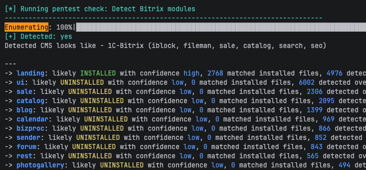
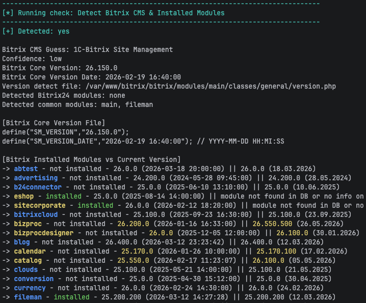
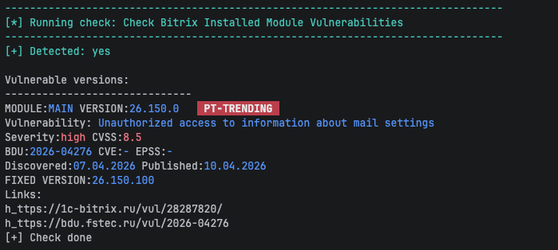

# BitrixProbe


BitrixProbe is a vulnerability assessment tool for CMS 1C-Bitrix/Bitrix24 installations. It is written in Python. 

It is designed around two separate assessment modes:
- `pentest`: external HTTP/HTTPS scans against a target URL.
- `audit`: authenticated local server scans over SSH.


### Legal Disclaimer & Responsible Use

BitrixProbe is intended only for authorized security testing, internal audits, research, and defensive assessment.

Please see [DISCLAIMER](./DISCLAIMER.md) for the full legal disclaimer.


## Why I Built BitrixProbe

I started BitrixProbe after facing a recurring problem in vulnerability scanning and remediation approval.

Bitrix-based systems are often heavily modified by web developers and integrators. These custom changes can make 
remediation slow, risky, or difficult to approve, especially in corporate environments where business logic 
depends on legacy code and custom modules.

As a result, vulnerable code exist in production for a long time. In many cases, security teams do not have 
enough visibility into which Bitrix components are exposed, which modules are installed, or which issues 
require urgent attention.

The first idea behind BitrixProbe was simple: build a small Python tool that keeps external web checks and 
authenticated server-side checks separate, collects useful evidence, and produces reports that are practical 
during real security assessments.

BitrixProbe is still evolving. Some checks focus on fingerprinting and exposure detection, while others are 
designed as vulnerability-specific probes or local audit checks.


## Features

- CVE, BDU, EPSS, CVSS, Positive Technologies Trending signal support
- Enumeration modules to support penetration tests and audit assessments.
- External Bitrix scans over HTTP and HTTPS.
- Authenticated local server audit scans over SSH.
- Standard result format for every module.
- Plain text report generation.
- Local vulnerability database updated daily.


## Tested Environment

BitrixProbe is developed and tested in a controlled lab environments.

| Target OS                                          | PHP Version | Web Server | Bitrix Version / Edition |
|----------------------------------------------------| --- | --- | -- |
| Ubuntu 24.04.4 LTS Linux 6.8.0-117-generic aarch64 | PHP 8.3.6 | Apache/2.4.58 | 1C-Bitrix/Bitrix24 26.150.0 |


## Modes

| Mode | Description | Authentication | Typical Use |
| --- | --- | --- | --- |
| `pentest` | External HTTP/HTTPS scans against a target URL. | Not required | Public exposure checks, fingerprinting, unauthenticated probes. |
| `audit` | Local server scans over SSH. | Required | Installed module checks, local configuration review, version comparison. |


## Scan Examples

BitrixProbe prints each module result while the scan is running and saves the
same human-readable evidence in a report. The following examples explain the
information produced by pentest and audit scans.


### Pentest Scan

Pentest modules perform external HTTP/HTTPS checks without requiring access to
the target server. For example, the `restore.php` exposure check can identify a
publicly reachable Bitrix backup restoration script.



The module reports the tested URL, HTTP response metadata, and the Bitrix markers that confirmed the finding. 
A positive `Detected: yes` result means the module found matching evidence.

Recon and enumeration are key in any attack. With this in mind, for security, it is important to understand what 
configurations and components are deployed and accessible to the attacker.
Bitrix has many modules that occasionally contain vulnerabilities. 
It is a good idea to try to identify which modules are installed in Bitrix. 
For this, I've made an enumeration check that compares present static files accessible on the web server 
with a wordlist. Its results might give clues about which default modules are present on the filesystem and installed.
By identifying plugins, it is possible to determine whether it is a 1C-Bitrix or Bitrix24 version of the CMS.
Below, we can see that the landing module is likely installed, and the CMS appears to be 1C-Bitrix CMS.




### Audit Scan

Audit modules run authenticated server-side checks through SSH. For example,
an audit check can compare installed Bitrix module versions with the local
vulnerability database. Below are some results for present and installed modules, as well as outdated versions.
Some module information might be missing from the database because the vendor does not share all data on their website.



The result below shows the installed module version, vulnerability identifiers,
severity, and the version containing the fix. For example, it displays the PT-Trending red flag, which signals 
that this vulnerability is actively exploited in CIS. It is similar to the US CISA KEV.
There is also an EPSS metric, but it is available only if CVE is present. 
Many vulnerabilities do not have CVE but instead have BDU.




### Result Statuses

| Output | Meaning |
| --- | --- |
| `Detected: yes` | The module completed and found matching evidence. |
| `Detected: no` | The module completed successfully but did not find the condition. |
| `Check skipped` | A required dependency was unavailable or was not detected. |
| `Failed` | A technical error prevented the module from completing normally. |


## Installation

Clone the repository and install the Python dependencies from the project root:

```bash
git clone https://github.com/ErSilh0x/bitrixprobe.git
cd bitrixprobe
python3 -m venv .venv
source .venv/bin/activate
pip install -r requirements.txt
```

Run BitrixProbe from the repository root:

```bash
python -m bitrixprobe --help
```


## Usage

Run external pentest scans:

```bash
python -m bitrixprobe pentest --url https://example.com
```

Run authenticated server-side audit scans over SSH:

```bash
python -m bitrixprobe audit \
  --host 192.168.56.10 \
  --port 22 \
  --user ubuntu \
  --webroot /var/www/bitrix
```

Reports are saved to the `reports/` directory by default.


### Environment File

BitrixProbe can read SSH audit connection settings from a `.env` file. This is
useful for audit mode because the SSH password is not accepted as a command-line
argument.

Create a `.env` file in the project root:

```env
BP_SSH_HOST=192.168.56.10
BP_SSH_PORT=22
BP_SSH_USER=ubuntu
BP_SSH_PASSWORD=change-me
```

Set strict file permissions before running audit mode:

```bash
chmod 640 .env
```

BitrixProbe checks the `.env` file permissions before loading it. The file must
not be a symlink, and the expected permission mode is `640`. If the file has
different permissions, BitrixProbe stops and prints the required `chmod` command.

Use the default `.env` file:

```bash
python -m bitrixprobe audit --webroot /var/www/bitrix
```

Use a custom environment file:

```bash
python -m bitrixprobe audit \
  --env-file ./lab.env \
  --webroot /var/www/bitrix
```

CLI values override `.env` values for SSH host, port, and username:

```bash
python -m bitrixprobe audit \
  --host 192.168.56.20 \
  --port 2222 \
  --user bitrix \
  --env-file .env \
  --webroot /var/www/bitrix
```

If host, port, username, or password are still missing after reading CLI options
and the `.env` file, BitrixProbe asks for them interactively.


### Options

Show the main help:
```bash
python -m bitrixprobe --help
```

Show pentest mode help:
```bash
python -m bitrixprobe pentest --help
```

| Option | Required | Description |
| --- | --- | --- |
| `--url` | Yes | Target URL, for example `https://example.com` or `https://192.168.56.10:8080`. If no scheme is provided, BitrixProbe uses `https://`. |

Show audit mode help:
```bash
python -m bitrixprobe audit --help
```

| Option | Required | Description |
| --- | --- | --- |
| `-H`, `--host` | No | SSH server address. Overrides `BP_SSH_HOST` from the `.env` file. |
| `-p`, `--port` | No | SSH server port. Overrides `BP_SSH_PORT`; defaults to `22` if not provided. |
| `-u`, `--user` | No | SSH username. Overrides `BP_SSH_USER` from the `.env` file. |
| `--env-file` | No | Path to the environment file. Defaults to `.env`. |
| `--webroot` | No | Remote Bitrix webroot directory. Defaults to `/var/www/html`. |
| `--output-dir` | No | Local directory for report files. Defaults to `reports`. |


## Using BitrixProbe with Docker

Build the Docker image from the BitrixProbe project root. The build context
must contain both `Dockerfile` and `requirements.txt`:

```bash
docker build --no-cache -t bitrixprobe:local .
```

Run BitrixProbe from Docker with the current host directory mounted as `/app`.
This keeps the local `.env` file outside the image and saves reports to
`$(pwd)/reports` on the host:

```bash
docker run --rm -it \
  -v "$(pwd):/app" \
  bitrixprobe:local --help
```

Run external web scans with a URL:

```bash
docker run --rm -it \
  -v "$(pwd):/app" \
  bitrixprobe:local pentest --url http://bitrix.local
```

If the target uses a local hostname, map it to the target IP for the container:

```bash
docker run --rm -it \
  --add-host bitrix.local:10.111.111.137 \
  -v "$(pwd):/app" \
  bitrixprobe:local pentest --url http://bitrix.local
```

Run SSH audit mode with a host/IP and port. Do not pass an HTTP URL to
`audit --host`:

```bash
docker run --rm -it \
  -v "$(pwd):/app" \
  bitrixprobe:local audit \
  --host 10.111.111.137 \
  --port 22 \
  --user ubuntu \
  --webroot /var/www/bitrix
```

For audit mode with a local `.env` file, keep `.env` in the current directory
and mount the directory into the container:

```bash
chmod 640 .env

docker run --rm -it \
  -v "$(pwd):/app" \
  bitrixprobe:local audit --webroot /var/www/bitrix
```

### Docker and VM Targets

If the target Bitrix installation is inside a VM, the container may not be able to
resolve or route to the VM even when the host machine can. A DNS error such as
`Name does not resolve` means the container cannot resolve the hostname. Use
`--add-host` or pass the target IP directly.

If the target IP also does not connect from inside the container, the issue is
network reachability. On Linux Docker Engine, try host networking:

```bash
docker run --rm -it \
  --net=host \
  -v "$(pwd):/app" \
  bitrixprobe:local audit \
  --host 10.111.111.137 \
  --port 22 \
  --user ubuntu \
  --webroot /var/www/bitrix
```

On Docker Desktop for macOS or Windows, `--net=host` usually does not provide
direct access to host-only VM networks. Use one of these approaches instead:

- Change the VM network adapter to bridged mode.
- Configure VM NAT port forwarding for SSH and HTTP/HTTPS.
- Use an SSH tunnel from the host and connect to `host.docker.internal` from
  the container.

Example SSH tunnel from the host for audit scans:

```bash
ssh -N -L 127.0.0.1:2222:10.111.111.137:22 ubuntu@10.111.111.137
```

Then run the container against the forwarded SSH port:

```bash
docker run --rm -it \
  -v "$(pwd):/app" \
  bitrixprobe:local audit \
  --host host.docker.internal \
  --port 2222 \
  --user ubuntu \
  --webroot /var/www/bitrix
```
For `pentest --url`, forward the VM web port through SSH from the host. This is
useful when the host can reach the VM, but the Docker container cannot route to
the VM network directly.

Forward HTTP from the VM to local port `8080`:

```bash
ssh -N -L 127.0.0.1:8080:127.0.0.1:80 ubuntu@10.111.111.137
```

Then scan the forwarded URL from Docker:

```bash
docker run --rm -it \
  -v "$(pwd):/app" \
  bitrixprobe:local pentest --url http://host.docker.internal:8080
```

For HTTPS, forward VM port `443` to local port `8443`:

```bash
ssh -N -L 127.0.0.1:8443:127.0.0.1:443 ubuntu@10.111.111.137
```

Then scan:

```bash
docker run --rm -it \
  -v "$(pwd):/app" \
  bitrixprobe:local pentest --url https://host.docker.internal:8443
```

Very often web server and Bitrix site will require a specific domain name, because there might be virtual domain configuration on web server. Keep the tunnel and add a host
mapping for the container. On macOS/Linux Docker Engine:

```bash
docker run --rm -it \
  --add-host bitrix.local:host-gateway \
  -v "$(pwd):/app" \
  bitrixprobe:local pentest --url http://bitrix.local:8080
```

Also, there are some commands to test network access from inside the container:

```bash
python -c "import socket; print(socket.gethostbyname('bitrix.local'))"
python -c "import socket; socket.create_connection(('10.111.111.137', 22), 5); print('ok')"
```
>*`https://bitrix.local` - a target url


## Vulnerability List

### Detection status legend

-  — detection is supported.
-  — HTTP pentest scan works only if vulnerability can be exploited without authentication in non-default CMS installations. By default, **requires** authenticated access.
-  — exploitation **requires** authenticated access in default CMS installations.
-  — vulnerability is a Denial of Service Attack
-  — detection is not implemented yet.


### Detection status

|  Detected  | Title                                                                                                                                                                                                                                              |       Module        | Severity |                      Vuln ID                      |                                         SSH Audit                                          |                                 Pentest Scan <br/>HTTP/S                                 |
|:----------:|------------------------------------------------------------------------------------------------------------------------------------------------------------------------------------------------|:-------------------:|:--------:|:-----------------------------:|:-----------------------------------------------------------------------------------:|:----------------------------------------------------------------------------------------:|
|     X      | Exposed Bitrix restore.php backup restore script detection                                                                                                                                                                                         |          X          |    10    |                                                   |                      |                    |
|     X      | Exposed Bitrix bitrixsetup.php installer script detection                                                                                                                                                                                          |          X          | Exposure |                                                   |                      |                    |
| 08.01.2026 | Local file inclusion when editing a landing page                                                                                                                                                                                                   |       landing       |   9.8    |                  BDU:2026-05965                   | |  |
| 07.04.2026 | Unauthorized access to information about mail settings                                                                                                                                                                                             |        main         |   8.5    |                  BDU:2026-04276                   | |  |
| 30.08.2025 | By filling out a crm form, an attacker can add extraneous content <br/>to the text of linked email newsletters                                                                                                                                     |         crm         |   3.1    |                  BDU:2025-15620                   | |                              |
| 21.04.2025 | Local File Inclusion when changing infoblock properties                                                                                                                                                                                            |       iblock        |    8     |                  BDU:2025-08666                   | |                              |
| 21.04.2025 | Reading arbitrary files when importing xml info block                                                                                                                                                                                              |       iblock        |   6.9    |                  BDU:2025-08665                   | |                              |
| 21.04.2025 | Reading arbitrary files when importing an info block                                                                                                                                                                                               |       iblock        |   6.9    |                  BDU:2025-08664                   | |                              |
| 17.04.2025 | Exceeding privileges when editing mail templates                                                                                                                                                                                                   |        main         |   7.1    |                  BDU:2025-08663                   | |                              |
| 17.04.2025 | Exceeding the limits when copying files                                                                                                                                                                                                            |       fileman       |   7.1    |                  BDU:2025-08662                   | |                              |
| 05.08.2024 | In a virtual machine, it is possible to elevate bitrix->root privileges                                                                                                                                                                            |      vmbitrix       |    8     |                  BDU:2025-04604                   |                                |                              |
| 16.12.2024 | In a virtual machine, it is possible to elevate bitrix->root privileges                                                                                                                                                                            |      vmbitrix       |    8     |                  BDU:2025-04539                   |                                |                              |
| 03.12.2024 | Stored XSS bypassing proactive protection in forum functionality                                                                                                                                                                                   |         ui          |    8     |                  BDU:2025-00765                   | |                              |
| 24.04.2024 | (Authenticated) The system administrator can retrieve the previously set password to the proxy server                                                                                                                                              |         dav         |   6,8    |         BDU:2024-08613<br/>CVE-2024-34883         | |  |
| 24.04.2024 | (Authenticated) The system administrator can retrieve a previously set SMTP password                                                                                                                                                               |        main         |   6,8    |         BDU:2024-08612<br/>CVE-2024-34882         | |  |
| 24.04.2024 | (Authenticated) The system administrator can retrieve a previously set Exchange password                                                                                                                                                           |         dav         |   6,8    |         BDU:2024-08611<br/>CVE-2024-34891         | |  |
| 24.04.2024 | (Authenticated) The system administrator can retrieve a previously set SMTP password                                                                                                                                                               |        main         |   6,8    |         BDU:2024-08610<br/>CVE-2024-34885         | |  |
| 24.04.2024 | (Authenticated) The system administrator can retrieve a previously set Active Directory password                                                                                                                                                   |        ldap         |   6,8    |         BDU:2024-08600<br/>CVE-2024-34887         | |  |
| 02.07.2024 | (Rejected CVE) If attackers use the virtual machine installer before the administrator does, <br/>they can gain control of the server.                                                                                                             | vmbitrix Ver. 7.5.5 |          |         BDU:2024-05252<br/>CVE-2022-29268         |                                |                              |
| 07.12.2023 | The bitrixsetup.php installation script did not escape an error message containing user input. <br/>Due to the lack of input parameter validation, it is possible to read files in the operating system.               |    bitrixsetup.php    |    3     |                  BDU:2024-01501                   |                  |                    |
| 30.03.2023 | (Authenticated) [RCE] Bitrix24 vulnerability related to errors in the data import mechanism. <br/>Exploitation of this vulnerability allows an internal attacker to increase his privileges in the system.              |         crm         |   8.8    |         BDU:2023-07464<br/>CVE-2023-1713          | |  |
| 30.03.2023 | (Authenticated) Stored Cross-Site Scripting [XSS] Bitrix24 vulnerability via Improper Input Neutralization on Invoice Edit Page. <br/>Chained with 2023-1716                                                         |         crm         |    9     |         BDU:2023-07463<br/>CVE-2023-1715          | |  |
| 30.03.2023 | Cross-Site Scripting [XSS] The 1C-Bitrix / Bitrix24 Proactive Protection flaw was missing a certain byte sequence <br/>that could be part of an XSS attack. <br/>Chained with CVE-2023-1715                                                  |      security       |    9     |         BDU:2023-07462<br/>CVE-2023-1716          | |                              |
| 30.03.2023 | Cross-Site Scripting [XSS] via Client-side Prototype Pollution in <br/>bitrix/templates/bitrix24/components/bitrix/menu/left_vertical/script.js                                                               |        main         |   9.6    |         BDU:2023-07461<br/>CVE-2023-1717          | |                              |
| 30.03.2023 | (Unauthenticated) [DOS] Denial of Service Vulnerability of 1C-Bitrix web project management system                                                                                          |        main         |   7.5    |         BDU:2023-07460<br/>CVE-2023-1718          | |                      |
| 30.03.2023 | (Unauthenticated) Insecure direct object reference [IDOR] - Bitrix24 Insecure Global Variable Extraction in bitrix/modules/main/tools.php                                                                      |      intranet       |   7.5    |         BDU:2023-07459<br/>CVE-2023-1719         | |                              |
| 10.04.2023 | (Unauthenticated) Stored Cross-Site Scripting [XSS] via uploading a crafted HTML file through `/desktop_app/file.ajax.php?action=uploadfile` (Bitrix24 22.0.300)                                                     |        main         |   9.3    |         BDU:2023-07458<br/>CVE-2023-1720         | |                              |
| 30.03.2023 | (Authenticated) [RCE] Bitrix24 vulnerability related to errors in the data import mechanism. <br/>Exploitation of this vulnerability allows an internal attacker to increase his privileges in the system.                   |        main         |   8.8    |         BDU:2023-07457<br/>CVE-2023-1714         | |  |
| 30.03.2023 | (Authenticated) [RCE] Bitrix24 vulnerability related to an error in input data processing.<br/>Exploitation of this vulnerability allows an internal attacker to execute<br/>arbitrary code on systems of certain configurations and php version |         crm         |   8.8    |         BDU:2023-07457<br/>CVE-2023-1714         | |  |
| 13.09.2023 | [RCE] Site content management system (CMS) landing module vulnerability                                                                                                                                    |       landing       |    10    |                  BDU:2023-05857                   | |                              |
| 28.10.2022 | Site content management system (CMS) vulnerability                                                                                                                                                                |        sale         |   9.8    |                  BDU:2023-05566                   | |                              |
| 24.10.2022 | Site content management system (CMS) vulnerability                                                                                                                                                                 |       fileman       |   9.6    |                  BDU:2023-05565                   | |                              |
| 05.12.2019 | [RCE] Vulnerability in the embedded code editor of the website content management system (CMS)                                                                                                                          |        main         |   9.8    |                  BDU:2023-02793                   | |                              |
| 28.10.2022 | (Authenticated) Vulnerability in the AD/LDAP server of Bitrix24 business management service<br/>that allows an intruder to gain unauthorized access to protected information.                               |        ldap         |   4.4    |        BDU:2023-01604<br/>CVE-2022-43959         | |  |
| 04.03.2022 | (Unauthenticated) [RCE] Vulnerability in the "vote" module of the website content management system (CMS)                                                                                                               |        vote         |   9.8    |        BDU:2022-01141<br/>CVE-2022-27228         |                                                                                          |                    |                             |
| 12.10.2020 | Reflected Cross-Site Scripting [XSS] Vulnerability of arParams`[API_KEY]` parameter of map.google component of Bitrix24<br/>business management service allowing an attacker to execute arbitrary JavaScript code.                                |       fileman       |   9.8    |                  BDU:2021-03055                   |                    |                              |
|            | Vulnerability of 1C-Bitrix web project management system                                                                                                                                                    |        main         |   4.6    |                  BDU:2014-00404                   |                                            -                                             |                                            -                                             |
|            | Vulnerability of 1C-Bitrix web project management system                                                                                                                                                        |        main         |    10    |                  BDU:2014-00403                   |                                            -                                             |                                            -                                             |


## Project Architecture

Keeping vulnerability data up to date manually can be time-consuming and error-prone. 
To solve this, I built a simple review-based vulnerability data pipeline that collects data from vulnerability sources, 
normalizes new records, and sends them for manual review before they are 
approved and pushed to GitHub.


## Project Structure

Each security assessment module, registered in the matching `__init__.py` file so the
runner can execute it.

```text    
BitrixProbe/
  bitrixprobe/                    Main Python package and scanner code
    cli.py                         Main CLI entry point
    config.py                      CLI and runtime configuration
    db/                           Local SQLite vulnerability database
    modes/                        Pentest and audit scan runners
        pentest.py                   External HTTP/HTTPS scan runner
        audit.py                     SSH audit runner
    modules/                      Shared clients, report helpers, and checks
      pentest_checks/             External HTTP/HTTPS Bitrix checks
      audit_checks/               Authenticated SSH server-side checks
        www_client.py                Shared HTTP helper functions
        ssh_client.py                Shared SSH helper functions
        out_report.py                Report output helpers
        db_connect.py                Helper functions for connecting to SQLite vulnerability database
    wordlists/                    Wordlists for endpoints, modules, and sensitive files
  reports/                        Generated scan reports
```
